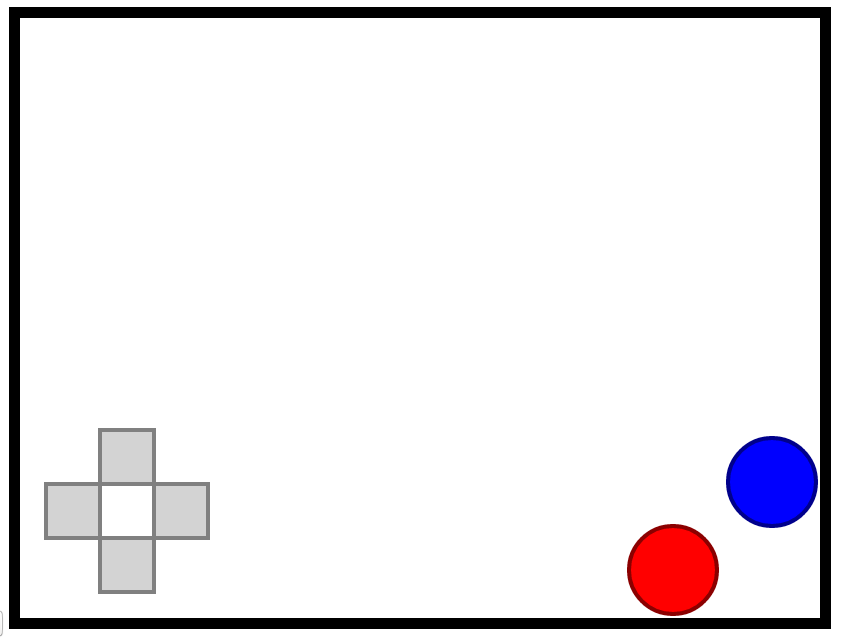

# canvas-gamepad

Gamepad over HTML canvas.
It draws a gamepad over your canvas and receives the click or tap events on the buttons and the direction pad (d-pad).

# Usage

Having a canvas with id 'c':

    const gamepad = new CanvasGamepad({
        canvasId: 'c'
    });

Then, receive the events when buttons and clicked:

    gamepad.addEventListener((eventData) => {
        console.log(eventData);
    });

'eventData' looks like this:

    {"A":false,"B":false,"up":false,"down":false,"left":true,"right":false}

